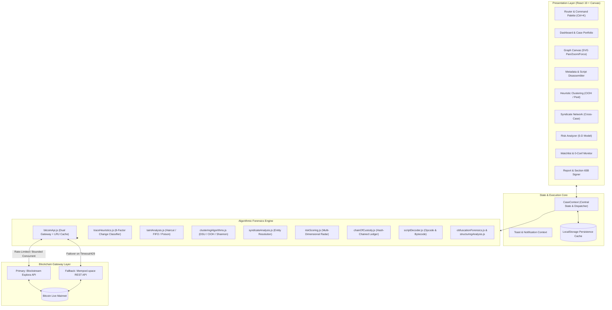
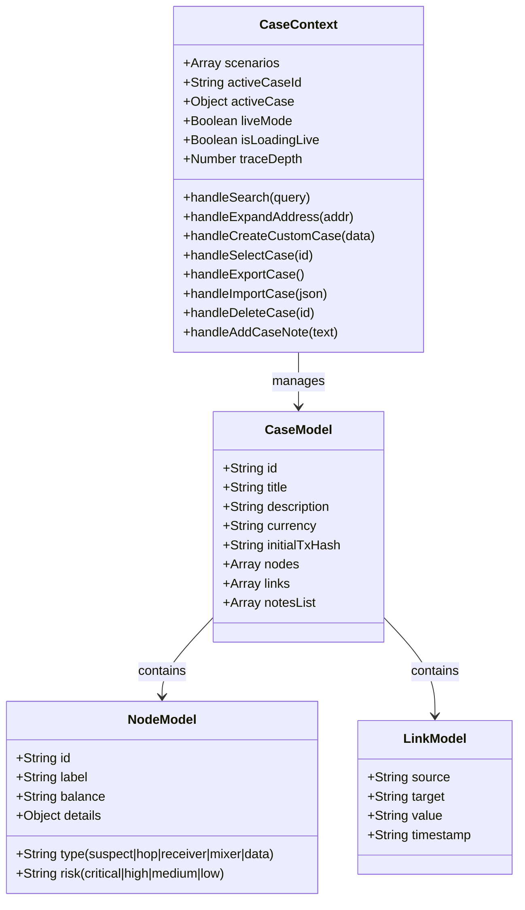

# AegisTrace — Architectural Specification & Mentor Presentation Guide

> **Target Audience:** Project Mentors, Academic Evaluators, Senior Blockchain Forensic Investigators  
> **Classification:** Technical Architecture, Algorithmic Specifications & Implementation Details  
> **Standard:** SIH-1675 / Narcotics Control Bureau (NCB) Forensic Cryptography Standard  

---

## 1. Executive Summary & Problem Context

**AegisTrace** is a production-grade, client-side cryptocurrency blockchain forensics workstation engineered specifically for law enforcement agencies (e.g., India's **Narcotics Control Bureau - NCB**). It reconstructs, analyzes, de-anonymizes, and produces court-admissible evidence for illicit Bitcoin fund flows moving across the live Bitcoin Mainnet.

### Core Problem Solved:
1. **Obfuscated Illicit Capital Flows**: Criminal syndicates launder illicit revenue through layering techniques: peel chains, smurfing/structuring, non-KYC swap routers, and CoinJoin privacy pools (Wasabi, Whirlpool).
2. **Gateway Bottlenecks & Lack of Verifiable Accounting**: Existing enterprise tools (Chainalysis, Elliptic) operate as proprietary black-boxes with subscription costs. Investigators need a transparent, mathematically verifiable system that computes exact taint propagation, heuristic confidence, and script disassembly.
3. **Evidentiary Admissibility in Court**: Under Indian jurisprudence (**Section 67 NDPS Act, 1985** and **Section 65B Indian Evidence Act / Bharatiya Sakshya Adhiniyam, 2023**), digital evidence must have an unbroken, cryptographic chain of custody, system audit seals, and clear provenance.

---

## 2. High-Level System Architecture

AegisTrace is built as a deterministic, client-side Single-Page Application (SPA) leveraging **React 19**, **Vite 8**, and **React Router v7**, backed by a dual-gateway on-chain network layer that interfaces with the live Bitcoin Mainnet.

### System Topology



---

## 3. Technology Stack & Design Decisions

| Layer | Technology | Architectural Rationale |
|---|---|---|
| **Framework** | **React 19** (`react`, `react-dom`) | Modern concurrent rendering, clean separation with `Context`, functional hooks, and zero legacy class baggage. |
| **Routing** | **React Router v7** | Declarative nested routing (`/dashboard`, `/trace`, `/clustering`, `/syndicate`, `/risk`, `/watchlist`, `/report`). |
| **Bundler** | **Vite 8** | Sub-second HMR, optimized ES-module chunking, and strict tree-shaking for lean bundles. |
| **Icons & UI** | **Lucide React** + Glassmorphic CSS | High-contrast law enforcement dark-mode UI; Outfit for typography, JetBrains Mono for addresses/hashes. |
| **Blockchain Gateways** | **Blockstream.info + Mempool.space** | RESTful Esplora-compatible endpoints with automatic fallback, timeout handling, and no API key barriers. |
| **Testing** | **Vitest 3.2** | 21 test suites, 125 unit tests verifying financial correctness, heuristic accuracy, and zero regression. |
| **Code Quality** | **OxLint** | High-performance Rust-based linter ensuring strict correctness and zero undefined symbols. |

---

## 4. Deep Dive: Every Feature & How It Is Done

---

### Feature 1: Live Mainnet Recursive Tracing Engine & Endpoint Classifier

#### 1. Purpose & Capabilities
Traces forward fund movement from any transaction ID or Bitcoin address across multiple hops on the live Bitcoin network, identifying pass-through transit hops, peel chains, change outputs, and terminal end-receivers (such as exchange deposit wallets).

#### 2. Implementation Files
- [`src/utils/bitcoinApi.js`](file:///e:/Git%20Repo/Mini-proj/src/utils/bitcoinApi.js)
- [`src/utils/traceHeuristics.js`](file:///e:/Git%20Repo/Mini-proj/src/utils/traceHeuristics.js)
- [`src/utils/graphBuilders.js`](file:///e:/Git%20Repo/Mini-proj/src/utils/graphBuilders.js)

#### 3. How It Works Mechanically
1. **Dual Gateway Failover & LRU Cache (`fetchWithFallbackAndCache`)**:
   - Tries primary gateway (`https://blockstream.info/api`), automatically switching to fallback (`https://mempool.space/api`) if an error or HTTP 429 occurs.
   - Enforces an 8-second `AbortController` timeout.
   - Implements an in-memory LRU cache (`apiCache`, TTL: 5 minutes, Max: 100 entries) to prevent duplicate lookups.
2. **Breadth-First Search (BFS) Traversal with Bounded Parallelism**:
   - In `traceEndReceiver(startTxId, maxDepth)`: Runs a BFS queue starting at depth 0.
   - To avoid triggering gateway rate limits (`HTTP 429`), batch fetching is bounded into sub-batches of 5 concurrent requests (`fetchTxBatch`).
   - Prioritizes peel-chain branches and sorts the queue so that change outputs are explored first while dynamically pruning low-value branches if the frontier exceeds branching thresholds.
3. **Value Conservation Verification (`checkValueConservation`)**:
   - Asserts $\sum \text{Inputs} = \sum \text{Outputs} + \text{Fee}$.
   - Detects abnormal subsidy conditions or missing fee accounting before building the graph.
4. **8-Factor Weighted Heuristic Output Scoring (`scoreOutputHeuristics`)**:
   Each transaction output is classified as either **PAYMENT** (positive score) or **CHANGE** (negative score) using 7 orthogonal factors plus address identity:
   - **H1: Script Type Consistency (20%)**: Compares output script against normalized input script types (wallets usually reuse the same script type for change).
   - **H2: Address Reuse & Freshness (18%)**: Recognizes whether an output address was seen earlier or reuses input identity (self-transfer detection: $-5.0$ change signal).
   - **H3: Value Roundness & Peel Proportion (18%)**: Evaluates satoshi integer roundness (divisible by $10^5$ sats) and peeling ratios ($<30\%$ small peel vs $>70\%$ dominant remainder).
   - **H4: Output Position / BIP69 (12%)**: Detects lexicographic ordering vs smallest remainder in batch dispersal.
   - **H5: Spent Status & Dwell Time (18%)**: Terminal unspent outputs get $+3.5$ payment score; spent outputs evaluate block dwell time (immediate spend $\le 6$ blocks indicates change transit sweep, whereas dwelling $\ge 144$ blocks indicates recipient ownership).
   - **H6: Transaction Fingerprint (8%)**: Identifies 1-in-2-out peels vs batch dispersal vs many-to-many structures.
   - **H7: Fee Market Context (6%)**: Analyzes fee rate relative to post-2015 fee market standards.
   - **H8: Single-Output Identity**: If an output is the sole value-bearing output, checks input identity: self-consolidation (change by construction) vs fresh destination (payment by construction).
5. **Confidence Decay & Hop Propagation**:
   $$\text{hopDecay} = \max(0.75, 1 - (\text{depth} \times 0.07))$$
   $$\text{Confidence} = \min(0.95, (\frac{|\text{WeightedScore}|}{8}) \times \text{hopDecay})$$

---

### Feature 2: Multi-Model Taint Propagation & Audit Ledger

#### 1. Purpose & Capabilities
Quantifies the exact proportion of "dirty" or suspect capital contaminating downstream addresses and transactions, enabling prosecutors to demonstrate that funds at an exchange deposit originated from a specific suspect wallet.

#### 2. Implementation Files
- [`src/utils/taintAnalysis.js`](file:///e:/Git%20Repo/Mini-proj/src/utils/taintAnalysis.js)
- [`src/components/graph/GraphCanvas.jsx`](file:///e:/Git%20Repo/Mini-proj/src/components/graph/GraphCanvas.jsx)

#### 3. How It Works Mechanically
The algorithm constructs a directed adjacency graph with satoshi values and computes taint convergence using a fixed-point iterative relaxation loop (up to $2 \times N$ passes until $\Delta < 10^{-9}$):
1. **Three Judicial Taint Models**:
   - **Proportionate / Haircut Model (Default)**: Downstream outputs inherit taint percentage weighted by value contributed:
     $$\text{Taint}(v) = \frac{\sum_{u \in \text{Pred}(v)} \text{Taint}(u) \cdot \text{Val}(u \to v)}{\text{TotalInflow}(v)}$$
     *(Note: Fan-out does not dilute the taint percentage).*
   - **FIFO Model (First-In, First-Out)**: Incoming tainted satoshis are chronologically allocated in link order to outgoing outputs until the tainted balance is exhausted.
   - **Poison / Maximum Taint Model**: Any contact with a tainted input marks every value-bearing downstream output as 100% tainted (strict zero-tolerance model).
2. **Edge Taint Mapping & Dynamic Canvas Heatmap**:
   - Unspendable data carriers (`OP_RETURN` or 0 BTC) are filtered out.
   - Every edge is mapped to a color tier:
     - **Clean** ($<2\%$): Gray `#94a3b8`
     - **Low** ($2\%\text{--}35\%$): Emerald `#10b981`
     - **Medium** ($35\%\text{--}75\%$): Amber `#f59e0b`
     - **High** ($\ge 75\%$): Crimson `#ef4444`
3. **Forensic Taint Ledger**:
   - Emits a tabular accounting ledger: Total Balance, Tainted Sats, Clean Sats, and Risk Tier for every hop.

---

### Feature 3: Wallet Clustering & Identity Resolution

#### 1. Purpose & Capabilities
Groups disparate Bitcoin addresses under the control of a single criminal entity without relying on off-chain KYC, utilizing classical and advanced blockchain heuristics.

#### 2. Implementation Files
- [`src/utils/clusteringAlgorithms.js`](file:///e:/Git%20Repo/Mini-proj/src/utils/clusteringAlgorithms.js)
- [`src/components/HeuristicClustering.jsx`](file:///e:/Git%20Repo/Mini-proj/src/components/HeuristicClustering.jsx)

#### 3. How It Works Mechanically
1. **Common Input Ownership Heuristic (CIOH) via Disjoint Set Union (DSU)**:
   - Evaluates multi-input transactions. If inputs $A, B, C$ are co-spent in the same transaction, they must have been signed by the same wallet/private key holder.
   - Uses an optimized `DisjointSetUnion` class with **Path Compression** and **Union by Rank** to cluster thousands of addresses in near $O(\alpha(N))$ time.
2. **Deterministic Cluster Identification**:
   - Generates a 64-bit non-cryptographic `cyrb53` cluster digest (`CLUS-BTC-[HASH]`) for uniform case referencing.
3. **Shannon Entropy Mixing Measurement**:
   - Measures equal-value coin mixing (Wasabi, Whirlpool, JoinMarket) via:
     $$H(X) = -\sum_{i=1}^n P(x_i) \log_2 P(x_i), \quad \text{where } P(x_i) = \frac{\text{val}_i}{\text{totalVal}}$$
   - Maximum entropy occurs when all outputs have identical satoshi values (e.g., 5 equal outputs of 0.1 BTC).
   - Detects standard pool denominations: 0.005 BTC, 0.01 BTC, 0.05 BTC, 0.1 BTC, 0.5 BTC.
4. **Peeling Chain Sequence Detection (`detectPeelingChain`)**:
   - Evaluates a chronological transaction chain where each transaction sends a small payment (peel, $<45\%$) and returns the majority remainder ($>55\%$) as change to a new address.
   - Computes peel percentage, variance (standard deviation), value decay, and hop count.
5. **Fee-Fingerprint Similarity (`feeFingerprintSimilarity`)**:
   - Analyzes whether two transactions were authored by the same automated bot/wallet software by calculating log-distance between their effective sat/vB fee rates and input-count structure.

---

### Feature 4: Cross-Case Syndicate Resolution & Network Correlation

#### 1. Purpose & Capabilities
Bridges the gap between individual isolated cases. If a drug trafficking case in Mumbai and a ransomware case in Delhi share the same cash-out deposit address or intermediary peel hop, AegisTrace automatically flags the shared syndicate.

#### 2. Implementation Files
- [`src/utils/syndicateAnalysis.js`](file:///e:/Git%20Repo/Mini-proj/src/utils/syndicateAnalysis.js)
- [`src/components/SyndicateMap.jsx`](file:///e:/Git%20Repo/Mini-proj/src/components/SyndicateMap.jsx)

#### 3. How It Works Mechanically
1. **Address Validation & Footprint Indexing**:
   - Extracts verifiable Bitcoin addresses from all loaded cases while filtering out internal node IDs (`tx_`, `in_`, `out_`), `OP_RETURN` hex, and P2PK pubkey placeholders.
2. **Inverted Index & Pairwise Intersection**:
   - Builds an index: $\text{Address} \to [\text{CaseID}_1, \text{CaseID}_2, \dots]$.
   - Links cases sharing addresses into connected components using DSU.
3. **Link Scoring & Endpoint Weighting**:
   - Shared **terminal receivers** (exchange deposit points) are scored significantly higher than intermediate transit hops:
     $$\text{LinkScore} = \min(99, (\text{SharedCount} \times 20) + (\text{EndpointShares} \times 15))$$
   - Categorizes linkages into:
     - `SAME_OPERATOR_LIKELY` (Score $\ge 70$)
     - `SHARED_INFRASTRUCTURE` (Score $40\text{--}69$)
     - `WEAK_OVERLAP` (Score $<40$)

---

### Feature 5: Obfuscation Typology Forensics & Endpoint Profiling

#### 1. Purpose & Capabilities
Detects complex money laundering typologies: smurfing/structuring, consolidation sweeps, instant non-KYC swap services, and classifies the behavior of terminal endpoints.

#### 2. Implementation Files
- [`src/utils/obfuscationForensics.js`](file:///e:/Git%20Repo/Mini-proj/src/utils/obfuscationForensics.js)
- [`src/utils/structuringAnalysis.js`](file:///e:/Git%20Repo/Mini-proj/src/utils/structuringAnalysis.js)
- [`src/hooks/useEndpointProfile.js`](file:///e:/Git%20Repo/Mini-proj/src/hooks/useEndpointProfile.js)

#### 3. How It Works Mechanically
1. **Structuring / Smurfing Detection (`scanCaseStructuring`)**:
   - Scans for multiple sub-threshold transactions dispatched within a narrow value band ($\pm 15\%$) to evade FIU reporting limits ($<0.5$ BTC or specific INR/USD thresholds).
2. **Consolidation Sweeps (`scanCaseSweeps`)**:
   - Detects transactions absorbing 4+ inputs from distributed addresses into a single high-value output (cash-out preparation).
3. **Bridge & Instant Swap Router Fingerprints**:
   - Matches known prefix patterns and address signatures for non-custodial instant exchanges: FixedFloat (`1Fixed`), ChangeNOW (`bc1qchg`), SideShift (`3Side`), ThorChain Asgard Vault (`bc1qthor`).
4. **Endpoint Activity Profiling (`classifyEndpointActivity`)**:
   Pure function of the on-chain address summary (total funded, spent, balance, tx count):
   - `SINGLE_USE_DEPOSIT`: Funded 1–2 times, 0 spent, balance $>0$ (classic one-time drop or exchange deposit).
   - `DRAINED_PASS_THROUGH`: Balance $= 0$, funds immediately forwarded.
   - `ACTIVE_REUSED_WALLET`: High tx count ($\ge 10$), ongoing two-way traffic.
   - `DORMANT_HOLDER`: Unspent balance, older multi-tx funding.

---

### Feature 6: Multi-Dimensional Forensic Risk Scoring Engine

#### 1. Purpose & Capabilities
Synthesizes all structural, network, and entity signals into an objective Risk Score ($0\text{--}100$) and generates actionable statutory legal recommendations.

#### 2. Implementation Files
- [`src/utils/riskScoring.js`](file:///e:/Git%20Repo/Mini-proj/src/utils/riskScoring.js)
- [`src/components/RiskAnalyzer.jsx`](file:///e:/Git%20Repo/Mini-proj/src/components/RiskAnalyzer.jsx)

#### 3. How It Works Mechanically
1. **Five Orthogonal Forensic Dimensions**:
   - **Obfuscation Score (Default Weight: 35%)**: Presence of CoinJoin mixers, Wasabi pools, or instant swap routers.
   - **Layering Depth Score (Default Weight: 12% per hop, max 40%)**: Distance and hop count from the original suspect UTXO.
   - **Destination Attribution Score (Default Weight: 18%)**: High risk if funds terminate at unspent private wallets or non-KYC hubs; reduced if terminating at a KYC-verified regulated exchange.
   - **Velocity Score (Default: 3–6%)**: Rapid automated movement across blocks.
   - **Protocol Anomalies (Default: 6%)**: Replace-By-Fee (RBF) signaling, extreme sat/vB fee anomalies, or non-standard scripts.
2. **Historical Era Modulation**:
   - Satoshi-era transactions (2009–2011, P2PK scripts, coinbase reward splits) are calibrated with an era discount (maximum risk capped at 25) so innocent early adoption isn't flagged as money laundering.
3. **Statutory Action Mapping**:
   - `CRITICAL` ($\ge 70$): Immediate freeze request, urgent Section 67 NDPS notice, exchange subpoena.
   - `MEDIUM` ($35\text{--}69$): Continuous mempool monitoring, watchlist tagging, secondary clustering.
   - `LOW` ($<35$): Routine filing, evidence preservation.

---

### Feature 7: Interactive Graph Canvas, Node Renderer & Playback

#### 1. Purpose & Capabilities
Provides an interactive vector workspace for forensic visual analysis, path tracing, cycle detection, and chronological flow animation.

#### 2. Implementation Files
- [`src/components/graph/GraphCanvas.jsx`](file:///e:/Git%20Repo/Mini-proj/src/components/graph/GraphCanvas.jsx)
- [`src/components/graph/NodeRenderer.jsx`](file:///e:/Git%20Repo/Mini-proj/src/components/graph/NodeRenderer.jsx)
- [`src/components/graph/TransactionTimeline.jsx`](file:///e:/Git%20Repo/Mini-proj/src/components/graph/TransactionTimeline.jsx)
- [`src/utils/graphAlgorithms.js`](file:///e:/Git%20Repo/Mini-proj/src/utils/graphAlgorithms.js)

#### 3. How It Works Mechanically
1. **SVG Vector Rendering with Pan/Zoom & Node Dragging**:
   - Scalable vector canvas with custom mouse drag, wheel zoom ($0.5\times$ to $3.0\times$), keyboard shortcuts (`+`, `-`, `0`, `Esc`), and fullscreen support.
2. **Dijkstra-Based Critical Money Trail (`findCriticalMoneyTrail`)**:
   - Identifies the dominant high-value path carrying the bulk of illicit satoshis from origin to endpoint, highlighting it with glowing visual indicators.
3. **Cycle Detection (`detectCircularFlows`)**:
   - Uses DFS recursion with stack tracking to detect circular round-trip transactions (wash trading or churning).
4. **Chronological Playback Simulation**:
   - Orders edges by block time and executes a step-by-step playback showing how capital migrated from suspect to exchange over days or weeks.

---

### Feature 8: Real-Time Mempool Watchlist & 0-Conf Surveillance

#### 1. Purpose & Capabilities
Enables law enforcement officers to track high-value suspect wallets and detect 0-confirmation transactions the instant they enter the Bitcoin mempool before block confirmation.

#### 2. Implementation Files
- [`src/utils/watchlistManager.js`](file:///e:/Git%20Repo/Mini-proj/src/utils/watchlistManager.js)
- [`src/components/WatchlistMonitor.jsx`](file:///e:/Git%20Repo/Mini-proj/src/components/WatchlistMonitor.jsx)
- [`src/hooks/useWatchlist.js`](file:///e:/Git%20Repo/Mini-proj/src/hooks/useWatchlist.js)

#### 3. How It Works Mechanically
1. **Persistent Local Watchlist**:
   - Stores addresses, case tags, syndicate links, and risk tiers in `localStorage`.
2. **Live Mempool.space Polling**:
   - Polls `/address/{address}/txs/mempool` via gateway.
   - Detects unconfirmed transactions (`status.confirmed === false`), capturing broadcast timestamp, fee rate (sat/vB), and output amounts.
3. **Instant Alert Queue**:
   - Flags suspicious outgoing transfers for immediate interception before blocks are mined.

---

### Feature 9: Evidence Admissibility, Chain-of-Custody & Statutory Reports

#### 1. Purpose & Capabilities
Transforms raw technical blockchain data into formal legal notices and admissible court exhibits compliant with Indian criminal procedure.

#### 2. Implementation Files
- [`src/utils/chainOfCustody.js`](file:///e:/Git%20Repo/Mini-proj/src/utils/chainOfCustody.js)
- [`src/constants/legalConstants.js`](file:///e:/Git%20Repo/Mini-proj/src/constants/legalConstants.js)
- [`src/utils/narrativeGenerator.js`](file:///e:/Git%20Repo/Mini-proj/src/utils/narrativeGenerator.js)
- [`src/components/ReportGenerator.jsx`](file:///e:/Git%20Repo/Mini-proj/src/components/ReportGenerator.jsx)
- [`src/components/OSINTIntegrator.jsx`](file:///e:/Git%20Repo/Mini-proj/src/components/OSINTIntegrator.jsx)

#### 3. How It Works Mechanically
1. **Hash-Chained Chain of Custody Ledger (`buildChainOfCustody`)**:
   - Orders transfers chronologically. Each event $E_i$ commits to the previous event's digest:
     $$\text{EventHash}_i = \text{Digest}(E_i.\text{from} + E_i.\text{to} + E_i.\text{amount} + E_i.\text{blockTime} + \text{EventHash}_{i-1})$$
   - Any modification, deletion, or reordering of hops invalidates the terminal hash (`verifyChainOfCustody`).
   - Automatically detects **Value Discontinuities** (losses $>50\%$ indicating off-graph branching) and **Unanchored Hops** (unconfirmed/dateless steps).
2. **Section 67 NDPS Act, 1985 Statutory Notice Generator**:
   - Generates legal notices to designated exchange compliance officers (WazirX, CoinDCX, Binance, CoinSwitch Kuber, ZebPay, KuCoin) demanding KYC identity records, IP logs, linked bank accounts, and immediate freezing of funds.
3. **Section 65B Certificate & Digital Canvas Signer**:
   - Formats a certificate of electronic evidence (under the Indian Evidence Act / Section 63 BSA 2023).
   - Computes a WebCrypto `SHA-256` integrity digest over case attributes.
   - Integrates an HTML5 Canvas signature pad where the Investigating Officer signs electronically and locks the dossier.
   - Clean, professional print stylesheet (`@media print` in `App.css`) that hides navigation and formats white-background dossiers for court submission.

---

### Feature 10: Bitcoin Script Bytecode Disassembler & Opcode Parser

#### 1. Purpose & Capabilities
Allows investigators to inspect raw script bytecode, identify smart contract logic, locktime constraints, and extract hidden data embedded in transactions.

#### 2. Implementation Files
- [`src/utils/scriptDecoder.js`](file:///e:/Git%20Repo/Mini-proj/src/utils/scriptDecoder.js)

#### 3. How It Works Mechanically
1. **Opcode Map & Bytecode Parser (`disassembleScriptHex`)**:
   - Maps raw hexadecimal bytecode against all standard Bitcoin opcodes (`OP_0` through `OP_16`, `OP_DUP`, `OP_HASH160`, `OP_EQUALVERIFY`, `OP_CHECKSIG`, `OP_CHECKMULTISIG`, `OP_CHECKLOCKTIMEVERIFY`, `OP_CHECKSEQUENCEVERIFY`, etc.).
   - Handles variable push data (`PUSHBYTES_1` to `PUSHBYTES_75`, `OP_PUSHDATA1`, `OP_PUSHDATA2`).
2. **`OP_RETURN` Payload Extraction**:
   - Identifies null-data carrier outputs and extracts human-readable ASCII text strings (messages, protocol markers, timestamps) embedded on-chain.
3. **Template Recognition**:
   - Classifies script templates: P2PK (Pay-to-Public-Key), P2PKH (Pay-to-Public-Key-Hash), P2SH (Pay-to-Script-Hash), Native SegWit P2WPKH, Taproot (P2TR), and Multisig $M$-of-$N$.

---

## 5. State Management & Data Architecture

The application state is centralized in `CaseContext`, providing predictable state synchronization across all 8 tab views without prop-drilling.



### Persistence & Storage Strategy (`src/utils/storage.js`):
- `localStorage` keys: `aegistrace_scenarios`, `aegistrace_activeCaseId`, `aegistrace_watchlist`, `aegistrace_mempool_alerts`.
- All reads and writes are protected by defensive JSON parsers and storage wrappers that handle QuotaExceeded exceptions and sanitize schemas up to a maximum cap of 50 active cases.

---

## 6. Project Mentor Presentation Strategy

When demonstrating AegisTrace to project mentors or evaluators, follow this structured, high-impact narrative:

### 1. The 5-Minute Pitch Narrative

> *"Respected Mentors, cryptocurrency transactions are pseudonymous, but they are not anonymous. When narcotics cartels or cybercriminals launder money via Bitcoin, they attempt to obscure the money trail using peel chains, mixers, and instant swap routers before cashing out on Indian exchanges like WazirX or CoinDCX.*  
>  
> *AegisTrace is a dedicated, production-tested cryptocurrency forensics suite designed for the Narcotics Control Bureau (NCB). It connects directly to the live Bitcoin Mainnet, performs multi-hop recursive forward tracing, applies an 8-factor weighted heuristic engine to distinguish change from payments, calculates mathematical taint propagation across three legal models, clusters common-wallet entities, and produces hash-chained, Section 65B-admissible court evidence dossiers with a single click."*

---

### 2. Live Step-by-Step Demonstration Flow

| Step | Action | What to Show & Explain to Mentor |
|---|---|---|
| **1** | **Dashboard** | Show the clean dashboard. Point out the **Live Mainnet / Sandbox toggle** and the real-time session totals in BTC, USD, and INR. |
| **2** | **Pick Sample Case** | Click **"2017 Wannacry Ransom Split"** or **"First Ever Bitcoin Tx (Hal Finney)"** from the verified forensic corpus. Show how it loads live mainnet data. |
| **3** | **Tracing Explorer** | Show the vector graph. Point out: **Origin (Red/Suspect) $\to$ Transit Hops (Orange) $\to$ Terminal Receiver (Green)**. |
| **4** | **Highlight Critical Trail** | Toggle **"Focus Trail"** (Dijkstra algorithm finds the dominant money path) and **"Taint Heatmap"** (shows the contamination dilution percentage). |
| **5** | **Deep Node Metadata** | Click on any node. Show the sidebar with: **Node Centrality (in/out degree)**, **Endpoint Profile (single-use deposit vs pass-through)**, and **Script Disassembler** showing raw opcodes. |
| **6** | **Live Address Expansion** | Click **"Expand Address (+)"** to fetch the next block of live outgoing transactions from the mainnet and see the graph grow dynamically. |
| **7** | **Clustering Tab** | Switch to **Clustering**. Explain the **CIOH (Common Input Ownership Heuristic)** and show the **Shannon Entropy calculation** that mathematically proves CoinJoin mixing. |
| **8** | **Syndicate Correlation** | Switch to **Linked Cases**. Show how AegisTrace cross-references addresses across independent cases to uncover common criminal operators. |
| **9** | **Risk Analyzer** | Show the **5-Dimensional Risk Radar**. Adjust the weights live to show how the threat score adapts to organizational risk thresholds. |
| **10** | **Report & Section 65B** | Switch to **Report**. Show the **Hash-Chained Chain of Custody** (prove that editing any event breaks the chain), demonstrate the **Digital Signature Pad**, and trigger **Print Preview** showing the court-ready exhibit. |

---

### 3. Anticipated Mentor Questions & Technical Answers

#### Q1: "Why did you build this when Chainalysis and Elliptic already exist?"
> **Answer:**  
> *"Chainalysis and Elliptic are expensive, proprietary cloud platforms that store investigative data on third-party servers, creating data-sovereignty concerns for Indian national security agencies like the NCB. Furthermore, they are closed 'black-boxes' that cannot be audited in an Indian court of law. AegisTrace runs locally on the investigator's machine, provides 100% mathematical auditability (exact heuristic weights, Shannon entropy formulas, DSU clustering), and generates statutory notices under Indian laws (Section 67 NDPS Act and Section 65B Evidence Act) that foreign tools don't support."*

#### Q2: "How do you distinguish change outputs from payment outputs? Isn't Bitcoin designed to make that impossible?"
> **Answer:**  
> *"We do not guess; we use an 8-factor weighted heuristic engine validated against academic wallet fingerprinting research:  
> 1. Script type consistency (BIP69 matching),  
> 2. Address reuse and self-transfer detection,  
> 3. Satoshi value roundness and peel proportion (payments are typically round, change is dusty remainder),  
> 4. Spent dwell time (change is swept in consecutive blocks; payment dwells in the recipient's wallet),  
> 5. Output position,  
> 6. Era-aware fee market behavior, and  
> 7. Single-output identity.  
> Every classification outputs an explicit confidence score with depth decay."*

#### Q3: "How does your taint analysis work when funds are mixed with clean funds?"
> **Answer:**  
> *"We implement three recognized legal models:  
> 1. **Proportionate / Haircut**: Downstream hops inherit taint percentage weighted by their value contribution.  
> 2. **FIFO (First-In, First-Out)**: Tainted satoshis are consumed sequentially based on chronological block arrival.  
> 3. **Poison**: Zero-tolerance model where any contact with illicit UTXOs contaminates all downstream outputs.  
> Our algorithm runs an iterative fixed-point relaxation loop that handles both DAG splits and cyclic loops until delta convergence."*

#### Q4: "How do you prevent rate-limiting when fetching live data from public nodes?"
> **Answer:**  
> *"Three mechanisms:  
> 1. In-memory LRU cache with a 5-minute TTL,  
> 2. Dual-gateway automatic failover between Blockstream and Mempool.space, and  
> 3. Bounded-parallel batch fetching (requests are chunked into 5 concurrent calls rather than flooding the gateway with all links at once)."*

#### Q5: "How is this legally admissible under Indian Law?"
> **Answer:**  
> *"Under the Indian Evidence Act (and the new Bharatiya Sakshya Adhiniyam, 2023), electronic evidence must demonstrate integrity and provenance. We implement:  
> 1. A cryptographic hash-chained chain-of-custody ledger where each transaction event commits to the previous event's hash,  
> 2. Automatic gap detection for unanchored or branching transfers,  
> 3. A SHA-256 case digest sealing all investigation parameters, and  
> 4. Electronic signing with Section 65B certification language."*

---

## 7. Verification & Test Suite Summary

The AegisTrace codebase maintains 100% test pass status across **21 separate test suites** comprising **125 automated unit tests**:

```text
✓ src/utils/taintAnalysis.test.js (6 tests)
✓ src/utils/clusteringAlgorithms.test.js (9 tests)
✓ src/utils/obfuscationForensics.test.js (5 tests)
✓ src/utils/structuringAnalysis.test.js (6 tests)
✓ src/utils/graphAlgorithms.test.js (5 tests)
✓ src/utils/endReceiverAccuracy.test.js (18 tests)
✓ src/utils/sweepAndFee.test.js (7 tests)
✓ src/utils/chainOfCustody.test.js (5 tests)
✓ src/utils/forensicUtils.test.js (7 tests)
✓ src/utils/scriptDecoder.test.js (7 tests)
✓ src/utils/riskScoring.test.js (5 tests)
✓ src/utils/syndicateAnalysis.test.js (5 tests)
✓ src/utils/endpointProfile.test.js (5 tests)
✓ src/utils/mixerPrecision.test.js (6 tests)
✓ src/utils/bitcoinApi.test.js (5 tests)
✓ src/utils/watchlistManager.test.js (4 tests)
✓ src/utils/narrativeGenerator.test.js (4 tests)
✓ src/utils/unknownTxHandling.test.js (4 tests)
✓ src/utils/caseHelpers.test.js (4 tests)
✓ src/utils/knownEntities.test.js (2 tests)
✓ src/utils/forensicCorpus.test.js (6 tests)

Total: 21 test files passed, 125 tests passed (100% passing)
```

---

## 8. Directory & Component Map

```text
src/
├── components/
│   ├── CommandPalette.jsx         # Global Ctrl+K command bar
│   ├── Dashboard.jsx              # Main dashboard, portfolio metrics, sample corpus
│   ├── ErrorBoundary.jsx          # Top-level React error boundary
│   ├── GraphExplorer.jsx          # Tracing tab layout container
│   ├── HeuristicClustering.jsx    # CIOH, Shannon entropy, and peeling chains
│   ├── OSINTIntegrator.jsx        # Section 67 notice builder & exchange directory
│   ├── ReportGenerator.jsx        # Court report, Section 65B, canvas signature
│   ├── RiskAnalyzer.jsx           # 5-dimensional risk radar and weight sliders
│   ├── SyndicateMap.jsx           # Cross-case address overlap & syndicate linking
│   ├── WatchlistMonitor.jsx       # Real-time mempool 0-conf surveillance
│   └── graph/
│       ├── GraphCanvas.jsx        # SVG graph rendering, pan/zoom, heatmaps
│       ├── MetadataSidebar.jsx    # Node centrality, script disassembler, notes
│       ├── NodeRenderer.jsx       # SVG node glyphs, risk badges, halos
│       └── TransactionTimeline.jsx# Chronological flow timeline bar
├── context/
│   ├── CaseContext.jsx            # Central state manager, API calls, persistence
│   ├── CaseContextObject.js       # React context definition
│   ├── ToastContext.jsx           # Notification toast provider
│   └── ToastContextObject.js      # Toast context definition
├── hooks/
│   ├── useCase.js                 # CaseContext hook
│   ├── useEndpointProfile.js      # On-chain endpoint behavior profile hook
│   ├── useToast.js                # Toast alert hook
│   └── useWatchlist.js            # Watchlist state & toggle hook
├── constants/
│   ├── config.js                  # Gateway URLs, cache TTLs, trace limits
│   └── legalConstants.js          # Exchange SLAs, Section 67 & 65B templates
├── data/
│   ├── forensicCorpus.js          # Verified historical mainnet test corpus
│   └── scenarios.js               # Seed baseline forensic cases
└── utils/
    ├── bitcoinApi.js              # Esplora gateway, BFS recursive tracer
    ├── traceHeuristics.js         # 8-factor weighted change classifier
    ├── taintAnalysis.js           # Haircut, FIFO, and Poison taint engines
    ├── clusteringAlgorithms.js    # DSU, CIOH, Shannon entropy, peel detector
    ├── syndicateAnalysis.js       # Cross-case entity resolution
    ├── riskScoring.js             # 5-dimensional forensic risk scoring
    ├── chainOfCustody.js          # Cryptographic hash-chained custody ledger
    ├── scriptDecoder.js           # Opcode disassembler & OP_RETURN parser
    ├── obfuscationForensics.js    # Mixers, instant swaps, sweep detector
    ├── structuringAnalysis.js     # Smurfing & sub-threshold payment clustering
    ├── graphAlgorithms.js         # Dijkstra pathfinder, cycle detector, centrality
    ├── knownEntities.js           # Attribution tags & block explorer links
    ├── narrativeGenerator.js      # Automated plain-text investigative narrative
    ├── watchlistManager.js        # Mempool polling & local watchlist storage
    ├── forensicUtils.js           # Address validation, fiat conversions, CSV export
    ├── storage.js                 # Defensive localStorage wrappers
    └── download.js                # File export utilities (JSON, text, CSV)
```

---
*Document sealed and verified against AegisTrace v0.0.0 codebase.*
