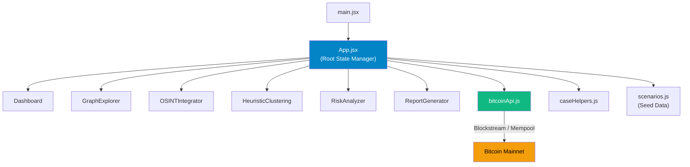
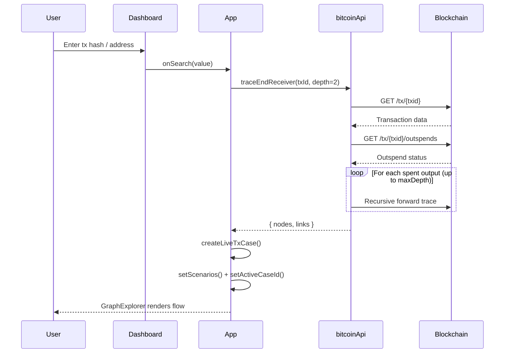

# AegisTrace — Codebase Analysis

## Overview

**AegisTrace** is a **cryptocurrency blockchain forensics suite** built for India's **Narcotics Control Bureau (NCB)**, designed as a React + Vite single-page application. It traces Bitcoin transaction flows on the **live mainnet** using public APIs (Blockstream / Mempool.space), visualizes fund movement graphs, and generates legal notices under **Section 67 of the NDPS Act, 1985**.

> [!IMPORTANT]
> This appears to be a **Smart India Hackathon (SIH 1675)** project. The app is a demonstrator/prototype — it uses real blockchain APIs but simulated OSINT/KYC data.

---

## Tech Stack

| Layer | Technology |
|---|---|
| Framework | **React 19** (JSX, functional components, hooks) |
| Build Tool | **Vite 8** with `@vitejs/plugin-react` |
| Icons | **Lucide React** |
| Fonts | **Outfit** (UI) + **JetBrains Mono** (addresses/hashes) |
| Linting | **OxLint** |
| Styling | Inline styles + CSS custom properties (dark theme) |
| State | React `useState` / `useEffect` with `localStorage` persistence |
| APIs | Blockstream.info + Mempool.space (REST, with failover + cache) |

---

## Architecture

---

## File-by-File Breakdown

### Entry & Config

| File | Purpose |
|---|---|
| [index.html](file:///c:/Users/Harish/Desktop/Testing/index.html) | HTML shell. Loads Google Fonts (Outfit, JetBrains Mono). Title: "AegisTrace - NCB Cryptocurrency Forensics Suite" |
| [main.jsx](file:///c:/Users/Harish/Desktop/Testing/src/main.jsx) | React 19 entry. Renders `<App />` inside `<StrictMode>` |
| [vite.config.js](file:///c:/Users/Harish/Desktop/Testing/vite.config.js) | Minimal Vite config with React plugin |
| [package.json](file:///c:/Users/Harish/Desktop/Testing/package.json) | Dependencies: React 19, Lucide React, Vite 8, OxLint |

### Styling

| File | Purpose |
|---|---|
| [index.css](file:///c:/Users/Harish/Desktop/Testing/src/index.css) | Global dark theme via CSS custom properties. Defines `.glass-panel`, `.mono-addr`, `.moving-dash` animation, custom scrollbars |
| [App.css](file:///c:/Users/Harish/Desktop/Testing/src/App.css) | Print media queries only — hides nav/footer, makes report area white for PDF export |

---

### Core Application

#### [App.jsx](file:///c:/Users/Harish/Desktop/Testing/src/App.jsx) — Root Component (373 lines)
The central state manager and router. Key responsibilities:

- **State**: `scenarios` (case list), `activeCaseId`, `activeTab`, `liveMode`, `isLoadingLive` — all persisted to `localStorage`
- **Search Logic** ([handleSearch](file:///c:/Users/Harish/Desktop/Testing/src/App.jsx#L106-L144)):
  - 64-char hex → treated as **Tx hash** → calls `traceEndReceiver()` for recursive forward trace
  - Starts with `bc1`, `1`, `3` → treated as **BTC address** → fetches address txs, traces latest
  - Anything else → **algorithmic mock trace** (deterministic fake graph from a hash)
- **Tab Navigation**: Dashboard | Fund Tracing Explorer | OSINT & Subpoenas | Wallet Clustering | AI Risk Grading | Forensic Report
- **Case Management**: Import/export JSON, reset to defaults
- **Address Expansion** ([handleExpandAddress](file:///c:/Users/Harish/Desktop/Testing/src/App.jsx#L153-L200)): Appends new tx nodes/links to existing graph

---

### Utility Modules

#### [bitcoinApi.js](file:///c:/Users/Harish/Desktop/Testing/src/utils/bitcoinApi.js) — Blockchain API Layer (385 lines)

The most technically significant file. Features:

| Function | Purpose |
|---|---|
| [fetchWithFallbackAndCache](file:///c:/Users/Harish/Desktop/Testing/src/utils/bitcoinApi.js#L12-L39) | Dual-gateway fetch (Blockstream → Mempool.space) with 5-min in-memory cache |
| [fetchTx](file:///c:/Users/Harish/Desktop/Testing/src/utils/bitcoinApi.js#L41-L43) | Get transaction details by txid |
| [fetchOutspends](file:///c:/Users/Harish/Desktop/Testing/src/utils/bitcoinApi.js#L45-L47) | Get outspend status for each output |
| [fetchAddressTxs](file:///c:/Users/Harish/Desktop/Testing/src/utils/bitcoinApi.js#L49-L51) | Get transactions for an address |
| [formatBlockstreamTx](file:///c:/Users/Harish/Desktop/Testing/src/utils/bitcoinApi.js#L56-L197) | Converts raw tx to graph nodes/links with heuristic classification |
| [traceEndReceiver](file:///c:/Users/Harish/Desktop/Testing/src/utils/bitcoinApi.js#L204-L383) | **Core algorithm** — Recursive forward tracing up to `maxDepth` hops. Identifies end receivers via: unspent UTXO detection, peeling chain analysis, P2SH/Taproot script matching |

> [!NOTE]
> **End Receiver Detection Heuristics:**
> 1. **Unspent outputs** → Terminal UTXO holder (end receiver)
> 2. **P2SH/Taproot scripts** or round values → Exchange deposit point
> 3. **Peeling chain** (2-output tx, smaller output) → Payment recipient
> 4. **Larger output** in 2-output split → Change address (hop)

#### [caseHelpers.js](file:///c:/Users/Harish/Desktop/Testing/src/utils/caseHelpers.js) — Case Factory (140 lines)

Three factory functions that create case objects with nodes/links:

| Function | Trigger |
|---|---|
| [createLiveTxCase](file:///c:/Users/Harish/Desktop/Testing/src/utils/caseHelpers.js#L5-L25) | Real tx hash lookup |
| [createAddressTraceCase](file:///c:/Users/Harish/Desktop/Testing/src/utils/caseHelpers.js#L27-L47) | Real address lookup |
| [createAlgorithmicTraceCase](file:///c:/Users/Harish/Desktop/Testing/src/utils/caseHelpers.js#L49-L139) | Fallback — generates deterministic mock graph from search string hash |

#### [scenarios.js](file:///c:/Users/Harish/Desktop/Testing/src/data/scenarios.js) — Seed Data (89 lines)

One default demo case (`case-btc-01`) with 4 nodes: Origin Input → Hop 1 → Hop 2 → End Receiver (Exchange Deposit).

---

### UI Components

#### [Dashboard.jsx](file:///c:/Users/Harish/Desktop/Testing/src/components/Dashboard.jsx) — 277 lines
- Search bar for tx hash / address input
- Sample quick-query buttons
- Session metrics (active traces, API status)
- Case list with import/export/reset controls

#### [GraphExplorer.jsx](file:///c:/Users/Harish/Desktop/Testing/src/components/GraphExplorer.jsx) — 700 lines ⭐ Largest component
The interactive SVG transaction flow visualizer:
- **Custom layout engine** — positions nodes by type (suspects → left, hops → center, receivers → right)
- **Pan & zoom** via mouse drag + scroll wheel
- **Node dragging** — drag any node to reposition it
- **Search & type filtering** within the graph
- **End Receiver highlight** mode with forensic overlay card
- **PNG export** of the canvas
- **Metadata sidebar** — shows selected node's address, KYC status, risk rationale, and "Trace Forward" button

#### [OSINTIntegrator.jsx](file:///c:/Users/Harish/Desktop/Testing/src/components/OSINTIntegrator.jsx) — 342 lines
- Simulated network IP attribution (mock data after 800ms delay)
- **Section 67 NDPS Act subpoena generator** — fully formatted legal notice with editable fields (exchange, FIR number, zonal unit, officer)
- Copy-to-clipboard and download as .txt

#### [HeuristicClustering.jsx](file:///c:/Users/Harish/Desktop/Testing/src/components/HeuristicClustering.jsx) — 316 lines
- Add/remove Bitcoin addresses for clustering
- **Live CIOH (Common Input Ownership Heuristic)** — fetches real tx histories and checks for shared txids across addresses
- Confidence scoring based on script type alignment + co-spending
- Educational SVG diagram explaining CIOH methodology

#### [RiskAnalyzer.jsx](file:///c:/Users/Harish/Desktop/Testing/src/components/RiskAnalyzer.jsx) — 163 lines
- Dynamic risk scoring based on graph properties (mixer presence, hop count, KYC status)
- Animated circular SVG gauge
- Explainability breakdown card showing score composition

#### [ReportGenerator.jsx](file:///c:/Users/Harish/Desktop/Testing/src/components/ReportGenerator.jsx) — 375 lines
- White-background printable forensic evidence report
- NCB-branded header with zonal unit selection
- Transaction hops index table
- End receiver attribution summary
- **Canvas-based signature pad** (draw or upload image)
- Integrity hash generation (deterministic from case data)
- Lock/unlock mechanism + print-to-PDF

---

## Data Flow

---

## Strengths

- **Real blockchain integration** — connects to live Bitcoin mainnet via dual-gateway failover
- **Recursive tracing algorithm** — follows outspends forward to find terminal end receivers
- **Rich interactive graph** — pan, zoom, drag nodes, filter, search, export PNG
- **Domain-specific tooling** — NDPS Act subpoena generator, CIOH clustering, risk scoring
- **Print-ready report** — white-background PDF with signature pad and integrity hash
- **Offline fallback** — algorithmic trace generates deterministic mock data when APIs fail
- **LocalStorage persistence** — cases survive page refresh

## Areas for Improvement

| Area | Issue | Suggestion |
|---|---|---|
| **State management** | All state lives in `App.jsx` with prop drilling 6 levels deep | Consider React Context or Zustand for shared state |
| **Inline styles** | Nearly all styling is inline JSX objects (~80% of component code) | Extract to CSS modules or a design system |
| **Component size** | `GraphExplorer.jsx` is 700 lines with layout, interaction, and rendering mixed together | Split into `GraphCanvas`, `NodeRenderer`, `MetadataSidebar` sub-components |
| **Error handling** | API errors silently fall back to mock data with `console.warn` | Add user-visible error states / toast notifications |
| **Security** | API cache is unbounded `Map()` — can grow indefinitely | Add max-size eviction or use LRU cache |
| **Accessibility** | No ARIA labels, keyboard navigation, or focus management | Add `role`, `aria-label`, `tabIndex` to interactive SVG elements |
| **Testing** | No test files present | Add unit tests for `bitcoinApi.js` heuristics and `caseHelpers.js` |
| **Routing** | Tab-based navigation with no URL routing | Add React Router for deep-linkable tabs |
| **TypeScript** | `@types/react` is installed but no `.ts`/`.tsx` files exist | Either use TypeScript fully or remove the type packages |
| **Hardcoded strings** | Exchange names, legal text, officer titles are embedded in components | Extract to constants/config files |

---

## Summary Statistics

| Metric | Value |
|---|---|
| Total source files | **11** (4 utils/data + 6 components + 1 entry) |
| Total lines of code | **~3,165** |
| Largest file | `GraphExplorer.jsx` (700 lines, 32KB) |
| External APIs | Blockstream.info, Mempool.space |
| Dependencies | 3 runtime (React, React DOM, Lucide) |
| Build tool | Vite 8 |
