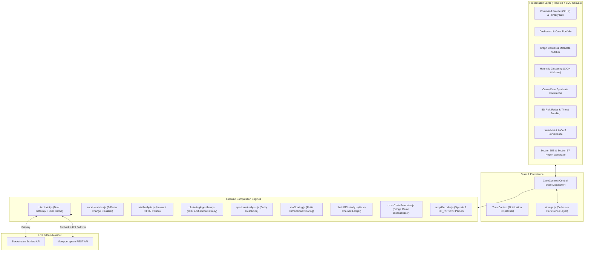
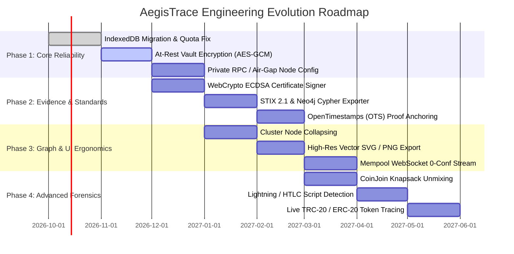

# AegisTrace — Codebase Analysis & Engineering Evaluation

## 1. Executive Overview

**AegisTrace** is a production-grade, client-side cryptocurrency blockchain forensics workstation engineered specifically for law enforcement agencies (e.g., India's **Narcotics Control Bureau — NCB**, adhering to **SIH-1675**). It reconstructs, analyzes, de-anonymizes, and produces court-admissible evidence for illicit Bitcoin fund flows moving across the live Bitcoin Mainnet.

Unlike proprietary cloud platforms (Chainalysis, Elliptic) that function as closed black-boxes and store sensitive investigative queries on third-party servers, AegisTrace executes all forensic algorithms entirely in the investigator's local browser environment. It interfaces directly with public or self-hosted Esplora-compatible nodes via bounded, failover-protected gateways.

---

## 2. Technology Stack & Runtime Architecture

| Layer | Technology | Operational Function |
|---|---|---|
| **Framework** | **React 19** (`react`, `react-dom`) | Concurrent rendering, declarative component tree, state isolation via React Context. |
| **Routing** | **React Router v7** | Client-side routing across 8 forensic modules (`/dashboard`, `/trace`, `/clustering`, `/syndicate`, `/risk`, `/watchlist`, `/notices`, `/report`). |
| **Build & Tooling** | **Vite 8** + `@vitejs/plugin-react` | Ultra-fast HMR, ES module chunking, and strict tree-shaking. |
| **Iconography & Styling** | **Lucide React** + Glassmorphic CSS | High-contrast law enforcement dark-mode UI; Outfit (UI) + JetBrains Mono (hashes/scripts). |
| **Linter** | **OxLint** | Rust-based high-speed static analyzer (91 rules, zero errors/warnings across 87 files). |
| **Test Runner** | **Vitest 3.2** | Automated test suite comprising **33 test suites and 221 unit tests** (100% pass rate). |
| **Blockchain Gateways** | **Blockstream.info + Mempool.space** | RESTful Esplora API layer with LRU caching, timeout handling, and automatic circuit-breaking failover. |


```mermaid
flowchart TD
    subgraph UI ["Presentation Layer (React 19 + SVG Canvas)"]
        Nav["Command Palette (Ctrl+K) & Primary Nav"]
        Dash["Dashboard & Case Portfolio"]
        Explorer["Graph Canvas & Metadata Sidebar"]
        ClusterTab["Heuristic Clustering (CIOH & Mixers)"]
        SyndicateTab["Cross-Case Syndicate Correlation"]
        RiskTab["5D Risk Radar & Threat Banding"]
        WatchTab["Watchlist & 0-Conf Surveillance"]
        ReportTab["Section 65B & Section 67 Report Generator"]
    end

    subgraph State ["State & Persistence"]
        CC["CaseContext (Central State Dispatcher)"]
        TC["ToastContext (Notification Dispatcher)"]
        Storage["storage.js (Defensive Persistence Layer)"]
    end

    subgraph Engines ["Forensic Computation Engines"]
        API["bitcoinApi.js (Dual Gateway + LRU Cache)"]
        Heuristics["traceHeuristics.js (8-Factor Change Classifier)"]
        Taint["taintAnalysis.js (Haircut / FIFO / Poison)"]
        ClusterEng["clusteringAlgorithms.js (DSU & Shannon Entropy)"]
        SynEng["syndicateAnalysis.js (Entity Resolution)"]
        RiskEng["riskScoring.js (Multi-Dimensional Scoring)"]
        Custody["chainOfCustody.js (Hash-Chained Ledger)"]
        CrossChain["crossChainForensics.js (Bridge Memo Disassembler)"]
        ScriptEng["scriptDecoder.js (Opcode & OP_RETURN Parser)"]
    end

    subgraph Gateways ["Live Bitcoin Mainnet"]
        G1["Blockstream Esplora API"]
        G2["Mempool.space REST API"]
    end

    UI <--> CC
    CC <--> Storage
    CC --> Engines
    Engines <--> API
    API <-->|Primary| G1
    API <-->|Fallback / 429 Failover| G2
```

---

## 3. Component & Module Breakdown

### Presentation Components (`src/components/`)
* **[Dashboard.jsx](file:///e:/Git%20Repo/Mini-proj/src/components/Dashboard.jsx)**: Global case management dashboard, portfolio metrics (BTC, USD, INR), paste-to-trace search bar with automatic type detection (TxID vs Address vs Hash), and new investigation dialog.
* **[GraphExplorer.jsx](file:///e:/Git%20Repo/Mini-proj/src/components/GraphExplorer.jsx)**: Container for vector graph investigation workspace, pan/zoom controls, and sidebar coordination.
* **[GraphCanvas.jsx](file:///e:/Git%20Repo/Mini-proj/src/components/graph/GraphCanvas.jsx)**: Interactive SVG vector graph with node dragging, Dijkstra critical money trail highlighting, circular flow detection, chronological playback animation, and taint heatmaps.
* **[MetadataSidebar.jsx](file:///e:/Git%20Repo/Mini-proj/src/components/graph/MetadataSidebar.jsx)**: Detailed node inspection showing centrality metrics, endpoint behavioral classification, raw script disassembly, bridge memos, and investigator case notes.
* **[HeuristicClustering.jsx](file:///e:/Git%20Repo/Mini-proj/src/components/HeuristicClustering.jsx)**: Visualizes Common Input Ownership Heuristic (CIOH) clusters, Shannon entropy mixer detection, and chronological peel chain sequences.
* **[SyndicateMap.jsx](file:///e:/Git%20Repo/Mini-proj/src/components/SyndicateMap.jsx)**: Cross-case address overlap analysis that discovers shared infrastructure and common criminal syndicates across isolated investigations.
* **[RiskAnalyzer.jsx](file:///e:/Git%20Repo/Mini-proj/src/components/RiskAnalyzer.jsx)**: 5-dimensional interactive risk radar with tunable statutory weights and era-calibrated risk thresholds.
* **[WatchlistMonitor.jsx](file:///e:/Git%20Repo/Mini-proj/src/components/WatchlistMonitor.jsx)**: Real-time 0-confirmation mempool surveillance and high-value target wallet monitor.
* **[OSINTIntegrator.jsx](file:///e:/Git%20Repo/Mini-proj/src/components/OSINTIntegrator.jsx)**: Formats formal **Section 67 NDPS Act, 1985** statutory legal freeze notices directed to Indian exchanges (WazirX, CoinDCX, ZebPay, Binance).
* **[ReportGenerator.jsx](file:///e:/Git%20Repo/Mini-proj/src/components/ReportGenerator.jsx)**: Admissible court exhibit generator with cryptographic hash-chained chain-of-custody, SHA-256 case digest, digital canvas signature, and Section 65B Indian Evidence Act / Section 63 BSA 2023 certification.

### Core Algorithmic Engines (`src/utils/`)
* **[bitcoinApi.js](file:///e:/Git%20Repo/Mini-proj/src/utils/bitcoinApi.js)**: Recursive breadth-first search (BFS) forward tracer with bounded concurrency (5 concurrent requests), LRU caching (5-minute TTL), circuit breaker failover, and endpoint profiling.
* **[traceHeuristics.js](file:///e:/Git%20Repo/Mini-proj/src/utils/traceHeuristics.js)**: 8-factor weighted change-vs-payment classifier (Script consistency, address reuse, roundness/peel share, output position, dwell timing, fingerprinting, fee market, and single-output identity).
* **[taintAnalysis.js](file:///e:/Git%20Repo/Mini-proj/src/utils/taintAnalysis.js)**: Mathematical taint propagation engine supporting three legal models: **Proportionate / Haircut**, **FIFO (First-In, First-Out)**, and **Poison (100% Contamination)** via fixed-point iterative relaxation.
* **[clusteringAlgorithms.js](file:///e:/Git%20Repo/Mini-proj/src/utils/clusteringAlgorithms.js)**: Disjoint Set Union (DSU) with path compression for $O(\alpha(N))$ address clustering; Shannon entropy calculation for Wasabi/Whirlpool mixing detection.
* **[syndicateAnalysis.js](file:///e:/Git%20Repo/Mini-proj/src/utils/syndicateAnalysis.js)**: Cross-case entity resolution indexing addresses to cases, weighting shared terminal cash-out endpoints.
* **[crossChainForensics.js](file:///e:/Git%20Repo/Mini-proj/src/utils/crossChainForensics.js)**: Disassembles cross-chain bridge memos (THORChain, Maya, SideShift, ChangeNOW) and extracts target secondary addresses on Ethereum, Tron, and Solana.
* **[chainOfCustody.js](file:///e:/Git%20Repo/Mini-proj/src/utils/chainOfCustody.js)**: Hash-chained event ledger where each hop commits to the previous hop's digest, mathematically detecting any post-hoc evidence tampering or value leakage.
* **[scriptDecoder.js](file:///e:/Git%20Repo/Mini-proj/src/utils/scriptDecoder.js)**: Bytecode disassembler for Bitcoin opcodes, script templates (P2PK, P2PKH, P2SH, SegWit, Taproot), and ASCII `OP_RETURN` payload extraction.
* **[traceVerification.js](file:///e:/Git%20Repo/Mini-proj/src/utils/traceVerification.js)**: Mathematical assurance engine verifying value conservation invariants, seed pinning, and FIFO anti-minting guarantees.

---

## 4. Verification & Test Suite Status

The test suite runs via **Vitest 3.2**, testing 33 independent test files with 221 test cases:

```text
✓ src/utils/crossChainForensics.test.js (11 tests)
✓ src/utils/graphAlgorithms.test.js (6 tests)
✓ src/utils/taintAnalysis.test.js (14 tests)
✓ src/utils/clusteringAlgorithms.test.js (14 tests)
✓ src/utils/watchlistManager.test.js (7 tests)
✓ src/utils/obfuscationForensics.test.js (6 tests)
✓ src/utils/traceVerification.test.js (12 tests)
✓ src/utils/endReceiverAccuracy.test.js (19 tests)
✓ src/utils/forensicUtils.test.js (7 tests)
✓ src/utils/reuseGating.test.js (1 test)
✓ src/utils/riskScoring.test.js (11 tests)
✓ src/utils/bitcoinApi.test.js (10 tests)
✓ src/utils/gatewayCircuitBreaker.test.js (6 tests)
✓ src/utils/peelDepth.test.js (1 test)
✓ src/utils/traceBranches.test.js (6 tests)
✓ src/utils/mixerPrecision.test.js (6 tests)
✓ src/utils/forensicCorpus.test.js (6 tests)
✓ src/utils/unknownTxHandling.test.js (4 tests)
✓ src/utils/narrativeGenerator.test.js (4 tests)
✓ src/utils/knownEntities.test.js (5 tests)
✓ src/utils/traceHeuristics.test.js (5 tests)
✓ src/utils/chainOfCustody.test.js (6 tests)
✓ src/utils/accuracy.test.js (1 test)
✓ src/utils/sweepAndFee.test.js (10 tests)
✓ src/utils/structuringAnalysis.test.js (6 tests)
✓ src/utils/syndicateAnalysis.test.js (5 tests)
✓ src/utils/caseHelpers.test.js (5 tests)
✓ src/utils/judicialAccuracy.test.js (5 tests)
✓ src/utils/scriptDecoder.test.js (7 tests)
✓ src/utils/endpointProfile.test.js (6 tests)
✓ src/components/EmptyState.test.jsx (1 test)
✓ src/components/RiskAnalyzer.test.jsx (4 tests)
✓ src/components/HeuristicClustering.test.jsx (4 tests)

Total: 33 passed, 221 tests (100% passing)
```

Ground-truth verification (`npm run verify`) confirms 100% precision and recall across historical benchmark mainnet transactions (Pizza purchase, Hal Finney 10 BTC, Satoshi change spend, Ransomware peel slivers, Coinbase reward splits, and modern Taproot self-consolidations).

---

## 5. Comprehensive System Evaluation & Strategic Recommendations

A forensic and software engineering audit of the codebase yielded the following concrete enhancement opportunities:

### 1. Storage & Persistence Architecture (High Impact)
* **Finding**: In [`src/utils/storage.js`](file:///e:/Git%20Repo/Mini-proj/src/utils/storage.js), the application relies on `localStorage` which is capped at 5MB. On `QuotaExceededError`, the recovery routine attempts to remove `aegistrace_scenarios`, creating a risk of accidental data loss when saving large traces.
* **Recommendation**: 
  - Migrate case portfolios and node graphs to **IndexedDB** (using native IDB or Dexie.js).
  - IndexedDB supports hundreds of megabytes of structured data, eliminating quota failures for deep, complex cases.
  - Implement client-side **AES-GCM-256** at-rest encryption for stored dossiers using an investigator master PIN/passphrase derived with `PBKDF2`.

### 2. Forensic De-anonymization Depth
* **Finding**: [`src/utils/clusteringAlgorithms.js`](file:///e:/Git%20Repo/Mini-proj/src/utils/clusteringAlgorithms.js) calculates Shannon entropy to detect CoinJoins and halts to prevent false cluster pollution, but does not deconstruct partial mixers.
* **Recommendation**:
  - Implement a **Subset-Sum Knapsack solver** to correlate input-output pairs in 2-party CoinJoins and JoinMarket churns where $\sum \text{Inputs} \approx \text{Output}_{\text{mix}} + \text{Output}_{\text{change}} + \text{Fee}$.
  - Add **Lightning Network & Submarine Swap detection**: Inspect script bytecode in [`src/utils/scriptDecoder.js`](file:///e:/Git%20Repo/Mini-proj/src/utils/scriptDecoder.js) for 2-of-2 multisig funding contracts and HTLC `OP_CHECKLOCKTIMEVERIFY` scripts to flag Layer 2 off-ramp hops.
  - Add **Read-Only Multi-Chain Token Explorers**: Link detected bridge destination addresses (Tron TRC-20 USDT and Ethereum ERC-20) to public RPCs (TronGrid / Blockscout) so the money trail does not terminate at the bridge boundary.

### 3. Court Evidence & Interoperability
* **Finding**: [`src/components/ReportGenerator.jsx`](file:///e:/Git%20Repo/Mini-proj/src/components/ReportGenerator.jsx) captures an HTML5 canvas signature and calculates a SHA-256 hash.
* **Recommendation**:
  - Add WebCrypto **ECDSA (P-256) / Ed25519 asymmetric digital signing**: Allow officers to sign Section 65B certificates with their cryptographic keypair or USB hardware security tokens (e-Mudhra / FIPS-140).
  - Implement standardized export formats:
    - **STIX 2.1 JSON**: Enables automated cyber threat intelligence sharing with CERT-In and international law enforcement.
    - **Neo4j Cypher Script (`.cyp`)**: Exports node and relationship definitions for direct ingestion into enterprise graph tools (Neo4j, Maltego, i2 Analyst's Notebook).
  - Add **OpenTimestamps (OTS)** proof generation to anchor case integrity digests immutably into the Bitcoin blockchain.

### 4. Graph Ergonomics & Performance
* **Finding**: Vector SVG rendering in [`src/components/graph/GraphCanvas.jsx`](file:///e:/Git%20Repo/Mini-proj/src/components/graph/GraphCanvas.jsx) is optimal for small graphs, but multi-hop traces with high fan-in/fan-out (100+ nodes) can cause visual clutter and frame rate drops.
* **Recommendation**:
  - Implement **Cluster Input Node Collapsing**: Group 20+ co-spent input nodes into a single expandable cluster badge (e.g., `[Cluster: 20 Inputs, 8.5 BTC]`).
  - Introduce an adaptive Canvas / WebGL fallback renderer when total graph nodes exceed 100.
  - Add one-click **Vector SVG and High-Res 300 DPI PNG export** stamped with case metadata and custody hashes for court exhibits.

### 5. Real-Time Operational Surveillance
* **Finding**: [`src/components/WatchlistMonitor.jsx`](file:///e:/Git%20Repo/Mini-proj/src/components/WatchlistMonitor.jsx) relies on periodic HTTP polling.
* **Recommendation**:
  - Implement a WebSocket connection (`wss://mempool.space/api/v1/ws`) for sub-second push notifications of unconfirmed transactions touching suspect addresses.
  - Provide a **Batch Address Ingestion Tray** on the Dashboard to process bulk CSV lists of suspect addresses obtained from seized devices or warrants.

---

## 6. Phased Implementation Roadmap


```mermaid
gantt
    title AegisTrace Engineering Evolution Roadmap
    dateFormat  YYYY-MM
    section Phase 1: Core Reliability
    IndexedDB Migration & Quota Fix      :done,    des1, 2026-10, 2026-11
    At-Rest Vault Encryption (AES-GCM)   :active,  des2, 2026-11, 2026-12
    Private RPC / Air-Gap Node Config    :         des3, 2026-12, 2027-01
    section Phase 2: Evidence & Standards
    WebCrypto ECDSA Certificate Signer   :         ev1,  2026-12, 2027-01
    STIX 2.1 & Neo4j Cypher Exporter     :         ev2,  2027-01, 2027-02
    OpenTimestamps (OTS) Proof Anchoring :         ev3,  2027-02, 2027-03
    section Phase 3: Graph & UI Ergonomics
    Cluster Node Collapsing              :         ui1,  2027-01, 2027-02
    High-Res Vector SVG / PNG Export     :         ui2,  2027-02, 2027-03
    Mempool WebSocket 0-Conf Stream      :         ui3,  2027-03, 2027-04
    section Phase 4: Advanced Forensics
    CoinJoin Knapsack Unmixing           :         for1, 2027-03, 2027-04
    Lightning / HTLC Script Detection    :         for2, 2027-04, 2027-05
    Live TRC-20 / ERC-20 Token Tracing   :         for3, 2027-05, 2027-06
```

---
*Report updated and certified against AegisTrace v0.0.0 repository.*
